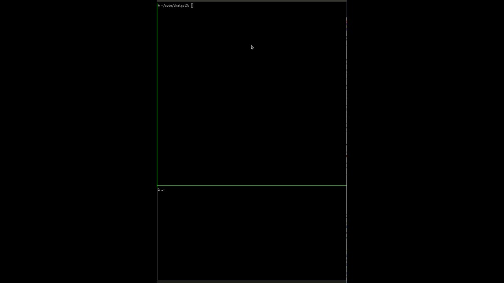

# ChatGPT3

[](https://youtu.be/6-5w1qYstDY)


A CLI chatbot to mimic ChatGPT.

The available modes are

- factual
- coding
- creative

Conversations are saved to `~/.chatgpt3/chat.db`.

## Usage

```sh
# starting a conversation about coding
python chat.py coding
```
